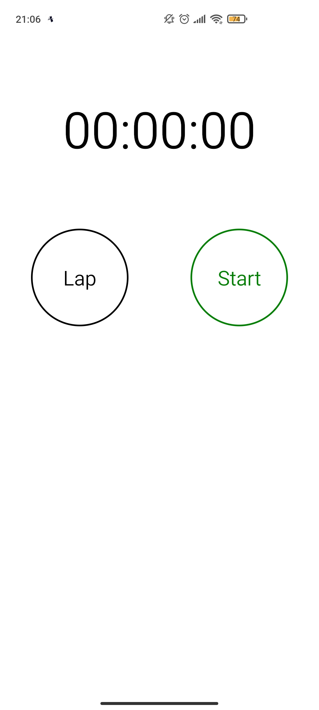
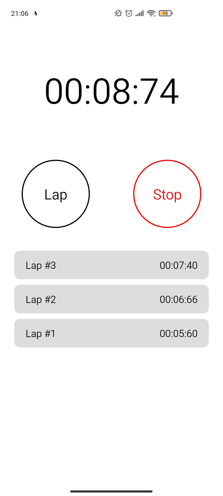
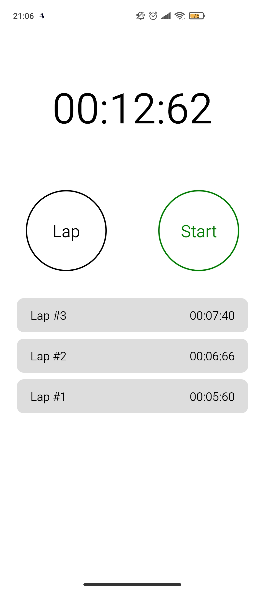

# Introduction 🎉
Hello everyone, StopWatchApp is a small project of me. I think you can learn more knowledge' react native

  

# Document 🍥
## Install 🚗
You clone this project into your computer by Git

```git
git clone https://github.com/minhcuongdev/StopWatchApp.git
```
1. Install library of project

```bash
#yarn
yarn

#npm
npm install
```

2. Start project

```bash
#yarn
yarn start

#npm
npm start
```
3. You use mobile phone and download expo from CHPlay or AppStore. Opening camera of expo and scan QR code on terminal

## Tutorial 📚
1. You press `Start`, time is running.
2. When you want to lap time, you press `Lap`
3. Press `Stop` to stop this time
4. Press `Lap` again, time will be reset 
